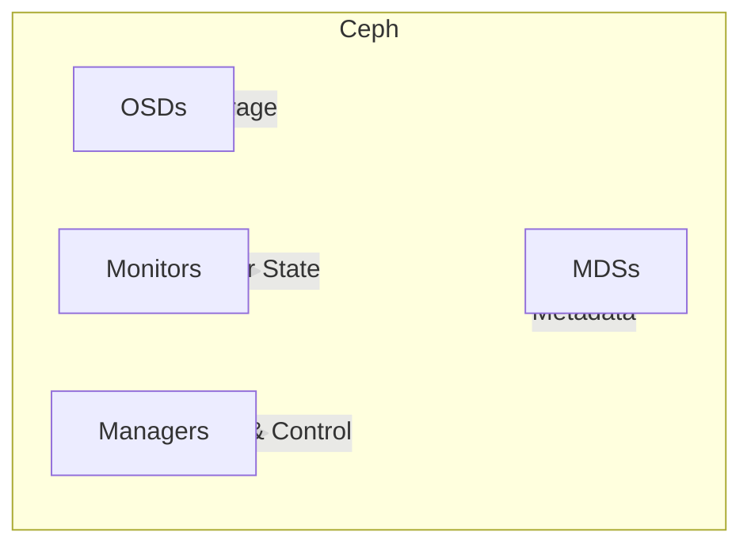

# overview

A Ceph Storage Cluster requires the following: at least one Ceph Monitor and at least one Ceph Manager, and at least as many [Ceph Object Storage Daemon](https://docs.ceph.com/en/reef/glossary/#term-Ceph-OSD)s (OSDs) as there are copies of a given object stored in the Ceph cluster (for example, if three copies of a given object are stored in the Ceph cluster, then at least three OSDs must exist in that Ceph cluster).

- **Monitors**: A [Ceph Monitor](https://docs.ceph.com/en/reef/glossary/#term-Ceph-Monitor) (`ceph-mon`) maintains maps of the cluster state, including the [monitor map](https://docs.ceph.com/en/reef/rados/operations/monitoring/#display-mon-map), manager map, the OSD map, the MDS map, and the CRUSH map. These maps are critical cluster state required for Ceph daemons to coordinate with each other. Monitors are also responsible for managing authentication between daemons and clients. At least three monitors are normally required for redundancy and high availability.
- **Managers**: A [Ceph Manager](https://docs.ceph.com/en/reef/glossary/#term-Ceph-Manager) daemon (`ceph-mgr`) is responsible for keeping track of runtime metrics and the current state of the Ceph cluster, including storage utilization, current performance metrics, and system load. The Ceph Manager daemons also host python-based modules to manage and expose Ceph cluster information, including a web-based [Ceph Dashboard](https://docs.ceph.com/en/reef/mgr/dashboard/#mgr-dashboard) and [REST API](https://docs.ceph.com/en/mgr/restful). At least two managers are normally required for high availability.↳
- **Ceph OSDs**: An Object Storage Daemon ([Ceph OSD](https://docs.ceph.com/en/reef/glossary/#term-Ceph-OSD), `ceph-osd`) stores data, handles data replication, recovery, rebalancing, and provides some monitoring information to Ceph Monitors and Managers by checking other Ceph OSD Daemons for a heartbeat. At least three Ceph OSDs are normally required for redundancy and high availability.
- **MDSs**: A [Ceph Metadata Server](https://docs.ceph.com/en/reef/glossary/#term-Ceph-Metadata-Server) (MDS, `ceph-mds`) stores metadata for the [Ceph File System](https://docs.ceph.com/en/reef/glossary/#term-Ceph-File-System). Ceph Metadata Servers allow CephFS users to run basic commands (like `ls`, `find`, etc.) without placing a burden on the Ceph Storage Cluster.
