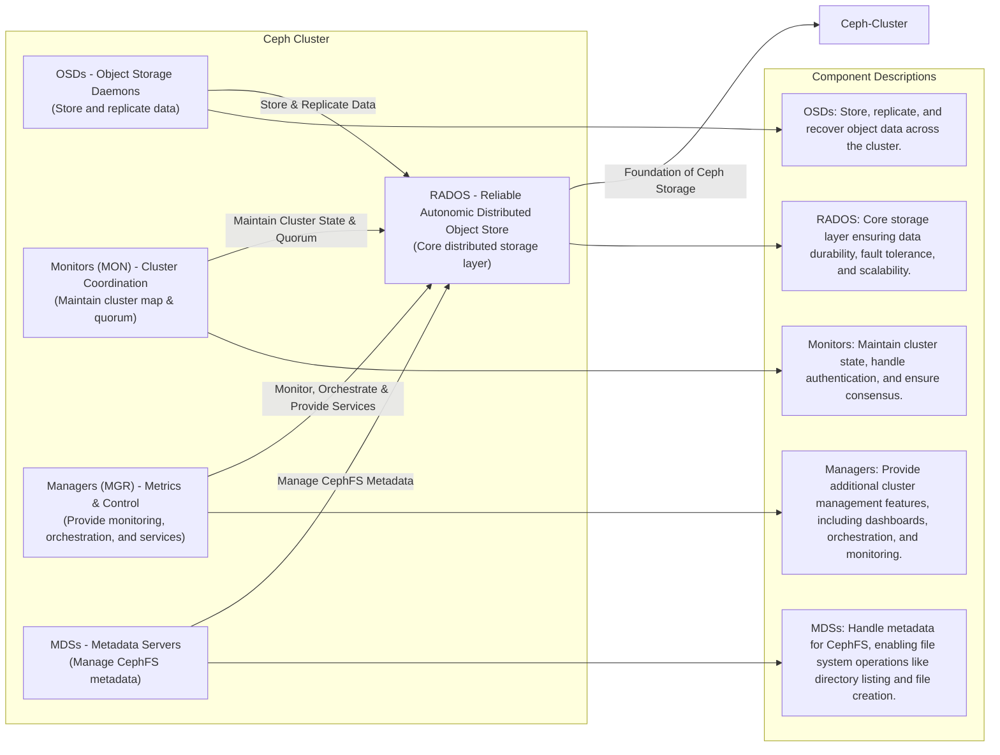
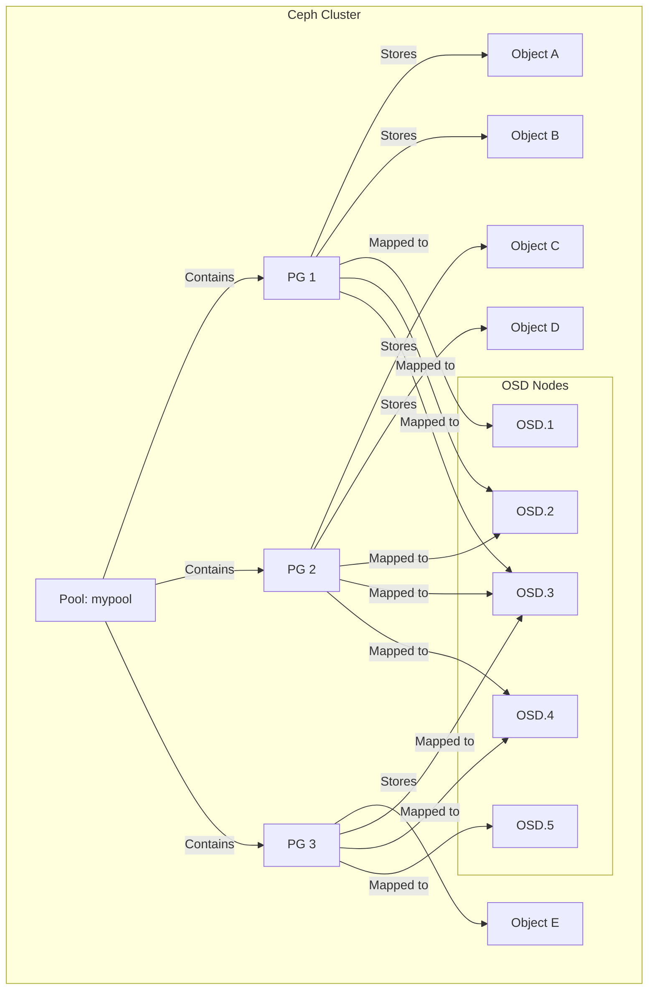

# overview

A Ceph Storage Cluster requires the following: at least one Ceph Monitor and at least one Ceph Manager, and at least as many [Ceph Object Storage Daemon](https://docs.ceph.com/en/reef/glossary/#term-Ceph-OSD)s (OSDs) as there are copies of a given object stored in the Ceph cluster (for example, if three copies of a given object are stored in the Ceph cluster, then at least three OSDs must exist in that Ceph cluster).



- **Monitors**: A [Ceph Monitor](https://docs.ceph.com/en/reef/glossary/#term-Ceph-Monitor) (`ceph-mon`) maintains maps of the cluster state, including the [monitor map](https://docs.ceph.com/en/reef/rados/operations/monitoring/#display-mon-map), manager map, the OSD map, the MDS map, and the CRUSH map. These maps are critical cluster state required for Ceph daemons to coordinate with each other. Monitors are also responsible for managing authentication between daemons and clients. At least three monitors are normally required for redundancy and high availability.

- **Managers**: A [Ceph Manager](https://docs.ceph.com/en/reef/glossary/#term-Ceph-Manager) daemon (`ceph-mgr`) is responsible for keeping track of runtime metrics and the current state of the Ceph cluster, including storage utilization, current performance metrics, and system load. The Ceph Manager daemons also host python-based modules to manage and expose Ceph cluster information, including a web-based [Ceph Dashboard](https://docs.ceph.com/en/reef/mgr/dashboard/#mgr-dashboard) and [REST API](https://docs.ceph.com/en/mgr/restful). At least two managers are normally required for high availability.

- **Ceph OSDs**: An Object Storage Daemon ([Ceph OSD](https://docs.ceph.com/en/reef/glossary/#term-Ceph-OSD), `ceph-osd`) stores data, handles data replication, recovery, rebalancing, and provides some monitoring information to Ceph Monitors and Managers by checking other Ceph OSD Daemons for a heartbeat. At least three Ceph OSDs are normally required for redundancy and high availability.

  

- **MDSs**: A [Ceph Metadata Server](https://docs.ceph.com/en/reef/glossary/#term-Ceph-Metadata-Server) (MDS, `ceph-mds`) stores metadata for the [Ceph File System](https://docs.ceph.com/en/reef/glossary/#term-Ceph-File-System). Ceph Metadata Servers allow CephFS users to run basic commands (like `ls`, `find`, etc.) without placing a burden on the Ceph Storage Cluster.

- **RADOS**: (Reliable Autonomic Distributed Object Store) Any Cluster that supports [Ceph Object Storage](https://docs.ceph.com/en/reef/glossary/#term-Ceph-Object-Storage) runs Ceph RADOS Gateway daemons (`radosgw`).

# architecture


## ceph block device

> RBD (Ceph Block Devices) 


Ceph block devices are thin-provisioned, resizable, and store data striped over multiple OSDs. Ceph block devices leverage RADOS capabilities including snapshotting, replication and strong consistency. Ceph block storage clients communicate with Ceph clusters through kernel modules or the `librbd` library.

## ceph object storage

> RGW (Ceph Object Storage Gateway)


Ceph Object Storage uses the Ceph Object Gateway daemon (`radosgw`), an HTTP server designed to interact with a Ceph Storage Cluster. The Ceph Object Gateway provides interfaces that are compatible with both Amazon S3 and OpenStack Swift, and it has its own user management. Ceph Object Gateway can use a single Ceph Storage cluster to store data from Ceph File System and from Ceph Block device clients. The S3 API and the Swift API share a common namespace, which means that it is possible to write data to a Ceph Storage Cluster with one API and then retrieve that data with the other API.

## ceph file system

> cephFS


The Ceph File System, or CephFS, is a POSIX-compliant file system built on top of Ceph’s distributed object store, **RADOS**. CephFS endeavors to provide a state-of-the-art, multi-use, highly available, and performant file store for a variety of applications, including traditional use-cases like shared home directories, HPC scratch space, and distributed workflow shared storage.

# Storage Interfaces

Ceph offers several “storage interfaces”, which is another way of saying “ways of storing data”. These storage interfaces include: - **CephFS**(a file system) - **RBD** (block devices) - **RADOS** (an object store).

Deep down, though, all three of these are really RADOS object stores. CephFS and RBD are just presenting themselves as file systems and block devices.

# Q&A

## pools vs placement groups vs object



> **Pool (mypool)** contains **multiple PGs** (Placement Groups).
>
> Each **PG stores multiple objects**.
>
> Each **PG is mapped to multiple OSDs**, based on the replication factor.
>
> **Objects are stored within PGs**, and Ceph automatically balances them across OSDs.

**Understanding the Relationship Between Placement Groups (PGs), Pools, and Objects in Ceph**

In Ceph, **objects**, **placement groups (PGs)**, and **pools** work together to distribute and store data efficiently. Here’s how they relate:

### Pools

> The Logical Storage Units

A pool in Ceph is a logical container that stores objects. Pools are used for different types of storage, such as:

- **RADOS block storage (RBD)**

- **CephFS (Ceph File System)**

- **RGW (RADOS Gateway for S3/Swift compatibility)**

A pool has properties like:

- **Replication factor (e.g., 3x replication)**

- **Erasure coding settings**

- **Number of placement groups (PGs)**

**Example:**

```
ceph osd pool create mypool 128
```

This creates a pool named **mypool** with **128 PGs**.

### Placement Groups (PGs)

> Buckets for Objects

A **placement group (PG)** is an internal grouping of objects within a pool. Instead of distributing objects directly across OSDs, Ceph first assigns objects to PGs. Then, PGs are mapped to OSDs.

**Why PGs?**

- They act as **intermediaries** between objects and OSDs.

- They help balance data across OSDs efficiently.

- They make recovery and replication easier.

**PG Calculation Example**

If a pool has **128 PGs** and uses a **3-replica** setting, each PG will be mapped to 3 different OSDs.

### Objects

> The Data Units in Ceph

An **object** is the fundamental data unit in Ceph. When you store a file in Ceph, it’s broken into one or more objects.

**How Objects Are Stored?**

1. **Objects are stored in a Pool** (e.g., mypool).

2. **Each object is mapped to a Placement Group (PG)**.

3. **The PG is mapped to multiple OSDs** (based on the pool’s replication settings).

4. **The primary OSD** handles writes and ensures copies are stored on secondary OSDs.

**Example Workflow:**

- A file is stored in **RGW (Ceph S3) → mypool**.

- The file is broken into **objects**.

- Each object is assigned to a **PG**.

- The PG is mapped to **3 OSDs** (in a replicated pool).

### Putting It All Together

**Example**

Assume:

- You create a **pool** called mypool with **128 PGs**.

- You upload a file that gets broken into **10 objects**.

- Each object is **hashed and assigned** to a PG.

- The PGs are **mapped to OSDs**.

| **Component**   | **Example Value**      |
| --------------- | ---------------------- |
| **Pool**        | mypool                 |
| **PG Count**    | 128                    |
| **Object Name** | obj12345               |
| **Object Hash** | hash(obj12345) → PG 45 |
| **PG Assigned** | PG 45                  |
| **Mapped OSDs** | OSD.3, OSD.7, OSD.12   |

In this case, **obj12345** will be stored in **PG 45**, which is replicated across **OSD.3, OSD.7, and OSD.12**.

**Key Takeaways**

- **Objects** are stored in **pools**.

- **Pools** contain **placement groups (PGs)**.

- **PGs** group multiple objects and map them to multiple OSDs.

- **OSDs** store object data and handle replication.

**Commands to Check PGs and Pools**

```shell
# List all pools:
ceph osd pool ls

# Check PG status:
ceph pg stat

# See which PGs belong to a pool:
ceph pg dump | grep mypool

# Check object distribution:
ceph osd df
```
