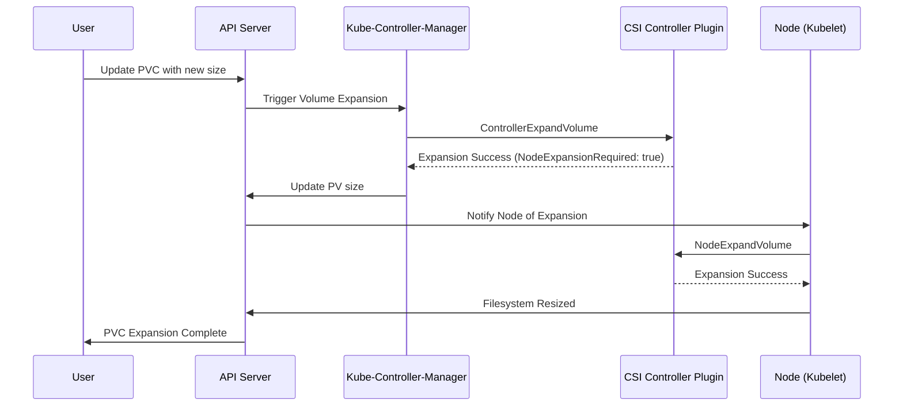

# RPC

In Kubernetes, the CSI (Container Storage Interface) plugin uses Unix domain sockets for communication between the kubelet and CSI drivers:

- Socket Location:  
  - `/var/lib/kubelet/plugins/csi.dingofs.com/csi-controller.sock`
  - `/var/lib/kubelet/plugins/csi.dingofs.com/csi.sock`

- Role: 

  - The CSI driver exposes its RPC interface via the Unix domain socket.

  - Kubelet connects to this socket to invoke RPC methods like CreateVolume or NodePublishVolume.

This approach ensures efficient and secure communication between the kubelet and the storage driver, without exposing the RPC interface over a network.

# basic

> Container Storage Interface **容器的持久化存储的含义**，就是用来保存容器存储状态的重要手段：存储插件会在容器里挂载一个基于网络或者其他机制的远程数据卷，使得在容器里创建的文件，实际上是保存在远程存储服务器上，或者以分布式的方式保存在多个节点上，而与当前宿主机没有任何绑定关系。这样，无论你在其他哪个宿主机上启动新的容器，都可以请求挂载指定的持久化存储卷，从而访问到数据卷里保存的内容。
>
> **CSI 插件体系的设计思想，就是把 Provision 阶段，以及 Kubernetes 里的一部分存储管理功能(比如“Attach 阶段”和“Mount 阶段”的具体操作)，从主干代码里剥离出来，做成了几个单独的组件**

一个 CSI 插件只有一个二进制文件，但它会以 gRPC 的方式对外提供三个服务（gRPC Service），分别叫作：CSI Identity、CSI Controller 和 CSI Node

**CSI 的设计思想**，把插件的职责从“两阶段处理”，扩展成了 Provision、Attach 和 Mount 三个阶段。其中，Provision 等价于“创建磁盘”，Attach 等价于“挂载磁盘到虚拟机”，Mount 等价于“将该磁盘格式化后，挂载在 Volume 的宿主机目录上”。


below diagram depicts a kind of high-level Kubernetes archetypes integrated with CSI:


> 在实际使用 CSI 插件的时候，我们会将这三个 External Components 作为 sidecar 容器和 CSI 插件放置在同一个 Pod 中。由于 External Components 对 CSI 插件的调用非常频繁，所以这种 sidecar 的部署方式非常高效。

- the external components are introduced to decouple Kubernetes and Storage Provider logic
- Blue arrows present the conventional way to call against API Server
- Red arrows present gRPC to call against Volume Driver

## External Components

- **Driver Registrar**

  **负责将插件注册到 kubelet 里面**（这可以类比为，将可执行文件放在插件目录下）。而在具体实现上，Driver Registrar 需要请求 CSI 插件的 Identity 服务来获取插件信息。

  > CSIDriver 是集群级别的，供其他namespace调用

- **External Provisioner**

  **负责 Provision 阶段**。在具体实现上，External Provisioner 监听（Watch）了 APIServer 里的 PVC 对象。当一个 PVC 被创建时，它就会调用 CSI Controller 的 CreateVolume 方法，创建对应 PV

- **External Attacher**

  **负责“Attach 阶段”**。在具体实现上，它监听了 APIServer 里 VolumeAttachment 对象的变化。VolumeAttachment 对象是 Kubernetes 确认一个 Volume 可以进入“Attach 阶段”的重要标志；

  一旦出现了 VolumeAttachment 对象，External Attacher 就会调用 CSI Controller 服务的 ControllerPublish 方法，完成它所对应的 Volume 的 Attach 阶段。

  ```
  kubernetes-csi/external-snapshotter: This project contains the sidecar container that watches Kubernetes VolumeSnapshot objects and triggers CreateSnapshot/DeleteSnapshot operations against a CSI endpoint.
  
  kubernetes-csi/external-provisioner: The external-provisioner is a sidecar container that watches Kubernetes PersistentVolumeClaim objects and triggers CreateVolume/DeleteVolume operations against a CSI endpoint.
  
  kubernetes-csi/external-attacher: The external-attacher is a sidecar container that watches Kubernetes VolumeAttachment objects and triggers ControllerPublish/Unpublish operations against a CSI endpoint.
  
  kubernetes-csi/node-driver-registrar: This sidecar container registers a CSI driver with the kubelet using the kubelet plugin registration mechanism.
  
  kubernetes-csi/livenessprobe: A sidecar container that can be included in a CSI plugin pod to enable integration with Kubernetes Liveness Probe
  ```


## Custom Components

- **CSI Identity**

  **负责对外暴露这个插件本身的信息**

- **CSI Controller**

  **定义的则是对 CSI Volume（对应 Kubernetes 里的 PV）的管理接口**，比如：创建和删除 CSI Volume、对 CSI Volume 进行 Attach/Dettach（在 CSI 里，这个操作被叫作 Publish/Unpublish），以及对 CSI Volume 进行 Snapshot 等

- **CSI Node**

  “Mount 阶段”在 CSI Node 里的接口，是由 NodeStageVolume 和 NodePublishVolume 两个接口共同实现的;

  当 kubelet 的 VolumeManagerReconciler 控制循环检查到它需要执行 Mount 操作的时候，会通过 pkg/volume/csi 包，直接调用 CSI Node 服务完成 Volume 的“Mount 阶段”

# provision

## Dynamic provisioning

- Create the PVC first.
- the CreateVolume request is triggered by Kubernetes when a PVC requests storage, and the CSI driver dynamically provisions the volume based on StorageClass and PVC parameters.

## Static provisioning

- Create the PV first.
- there is no CreateVolume request. Instead, the PV is manually created, and the CSI driver accesses an already provisioned volume using information like volumeHandle from the PV YAML.

# senarios

## expand volume



